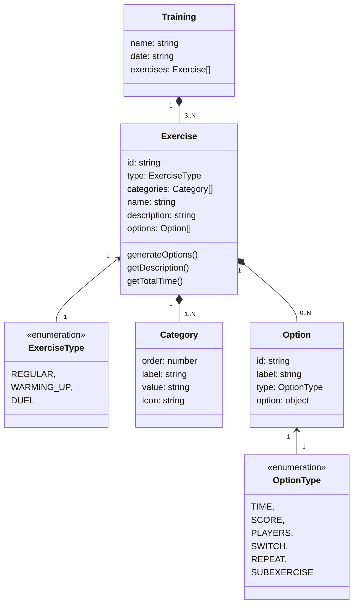

# Korfbal Trainer

An app that generates a training based on a list of settings.
Can generate different types of exercises with different scores or time limits.

Live Environment: <https://korfbal-trainer.netlify.app/>

---

## Install dependencies

This projects uses Vue3 with Vite and Yarn for faster local development

```bash
yarn install
```

### Run development environment (Hot-reloads) on <http://localhost:3000/>

```bash
yarn dev
```

### Lint the project

```bash
yarn lint
```

### Build for production environment

```bash
yarn build
```

---

## Korfbal Trainer model setup

The idea was to have a complete training, that exists of multiple exercises that have different options based on some min and max properties that are being generated by the application.

The Option class houses the logic to generate the desired amount needed in the exercise. In the exercise we then



## Json data file example for an exercise

```json
{
    "id": "legertje",
    "type": "regular"
    "categories": [
        "run",
        "warm-up"
    ],
    "name": "Legertje",
    "description": "Het hele team loopt op goed tempo om het veld. Als de trainer 1 roept doen alle spelers een sprong, 2 een kikkerspring, 3 is omdraaien en 4 is een klein sprintje trekken",
    "options": [
        {
            "id": "time",
            "label": "Tijd",
            "type": "TIME",
            "variables": {
                "min": 5,
                "max": 15
            }
        },
        {
            "id": "people",
            "label": "Personen",
            "type": "PLAYERS"
        },
        {
            "id": "repeat",
            "label": "Hoeveelheid",
            "type": "REPEAT",
            "variables": {
                "type": "TIME",
                "min": 3,
                "max": 8
            }
        }
    ]
}
```
